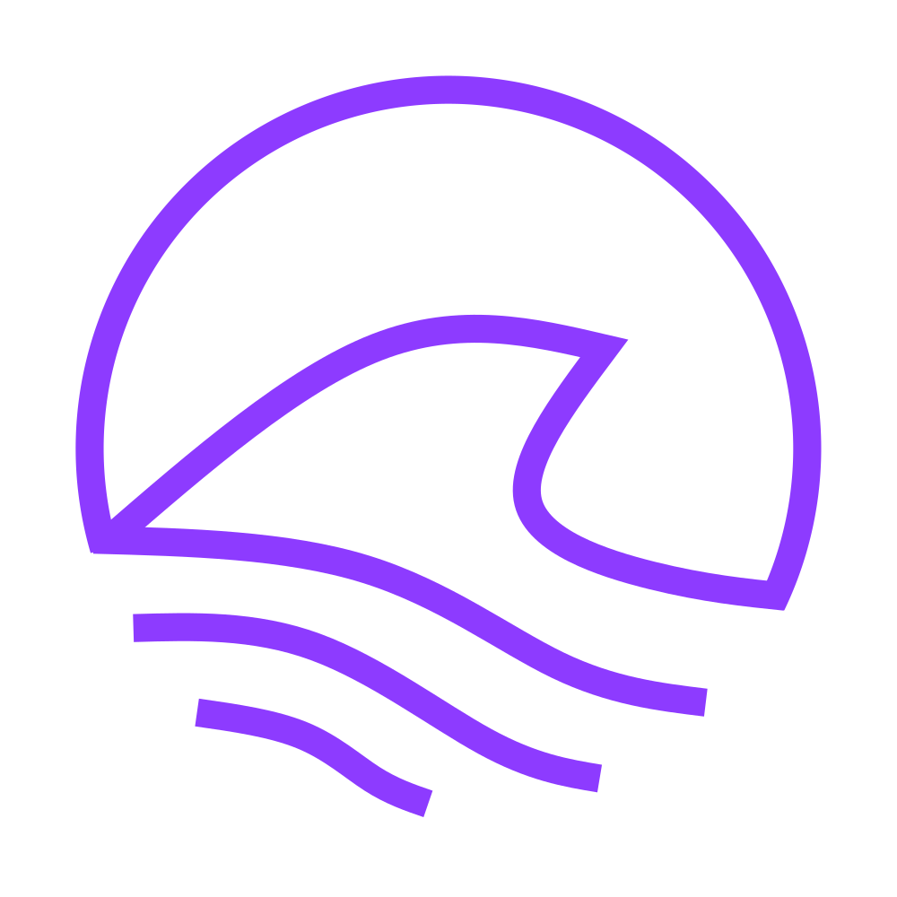

# Uptime-Shark

<div align="center">
    
</div>

Uptime-Shark is a simple, self-hosted web monitoring solution. Launch, add your own webpages, receive notifications about downtime.

<div>
    
    
</div>

# How to Use
```
# Create a volume
docker volume create uptime-shark

# Start the container
docker run -d --restart=unless-stopped -p 8080:8080 -v uptime-shark:/app/db --env APIPASSWORD=CHANGETHISPASSWORD --name uptime-shark yellowtech/uptime-shark
```
and navigate to [localhost:8080](http://localhost:8080).

or with docker-compose (uncomment environment variables to set telegram notification settings)
```
version: "3"
services:
  uptime-shark:
    image: yellowtech/uptime-shark
    container_name: uptime-shark
    volumes:
      - ./db:/app/db
    environment:
      # # the telegram api key
      # - TELEGRAMKEY=telegram-bot-api-token
      # # your telegram chat id
      # - TELEGRAMCHAT=your-chat-id
      - APIPASSWORD=yoursupersecretpassword!@#$%$#@!
    ports:
      - 8080:8080
    restart: unless-stopped

```

To obtain your bot api key and chat id, follow this tutorial: https://tutorial.cytron.io/2021/09/01/how-to-create-a-telegram-bot-get-the-api-key-and-chat-id/
